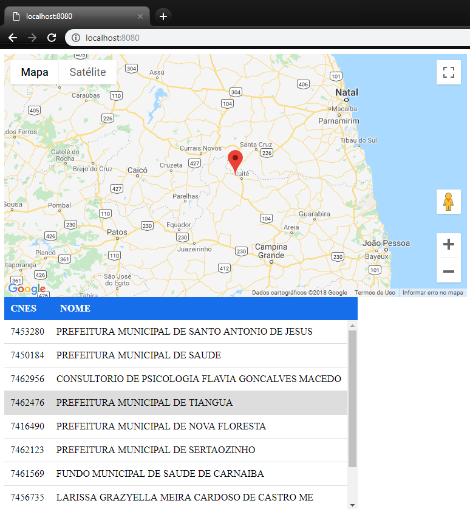

# CNES Web App

Aplicação Web destinada a mostrar os estabelecimentos cadastrados no CNES.

## Instruções

- npm install
- npm install http-server
- node CAMINHO PARA node_modules/http-server/bin/http-server
- Abra a aplicação em localhost:8080